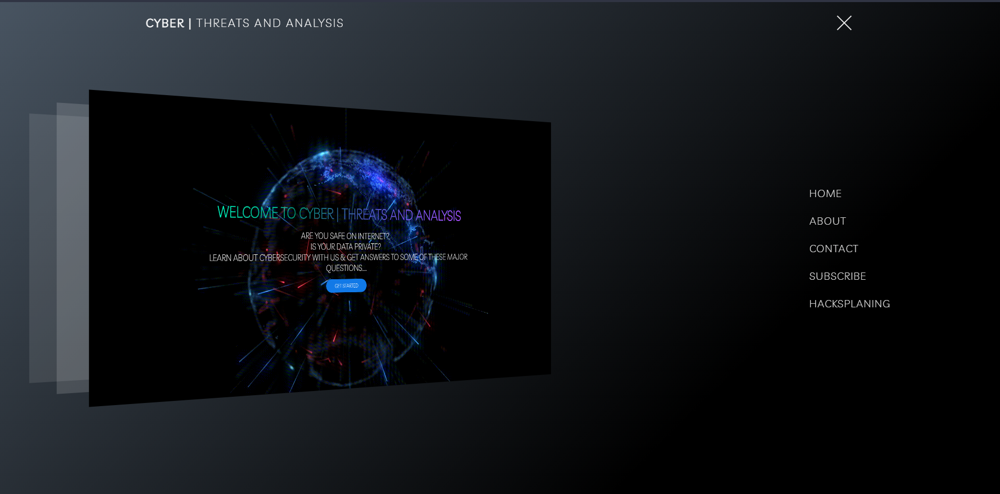

<h2 align="center">😄🅲🆈🅱🅴🆁 🆃🅷🆁🅴🅰🆃 🅰🅽🅰🅻🆈🆂🅸🆂😃</h2>

<h3 align="center">😎This Is A ❚█══CYBER THREAT ANALYSIS══█❚🤖</h3>
 

<h2 align="center">THIS IS MY FIRST UNIVERSITY WEBSITE PROJECT</h2>

<ul>
<li><b>LANGUAGE USED:- HTML,CSS,JAVASCRIPT,FIREBASE</b></li>
<li><b>SOFTWARE:- VS CODE</b></li> 
</ul>

<h2>Usage😁:-</h2>
<ul>
<li>This will make People aware of the increasing Cyber Threats and How to Be Safe From Them</li></ul>
 

## Not Maintaining Little Unresponsive Feel Free to Work On
